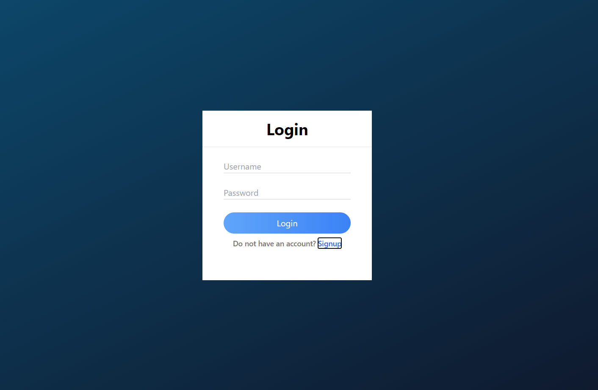
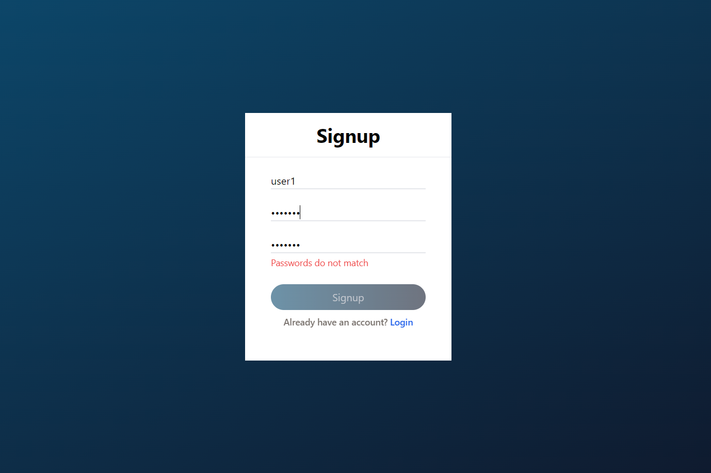

# Chat React Application

This is a full stack application and it was built using MERN stack.
This chat application has an authentication step which ensures that the user is registered.
When inside the application users can add friends which are displayed from the database.
Users who have invited their friends can start chating with each other in real-time with the help of sockets.

## Screenshots

Login window

Signup window

