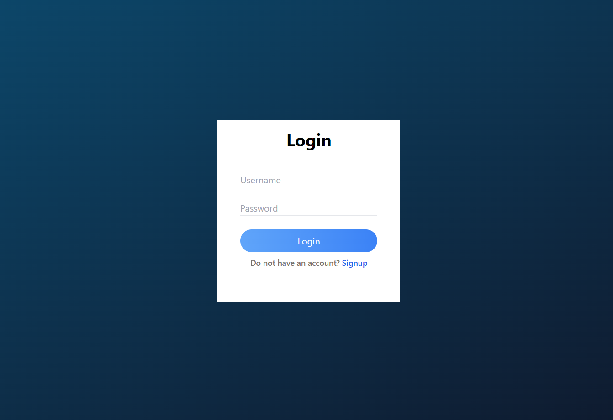
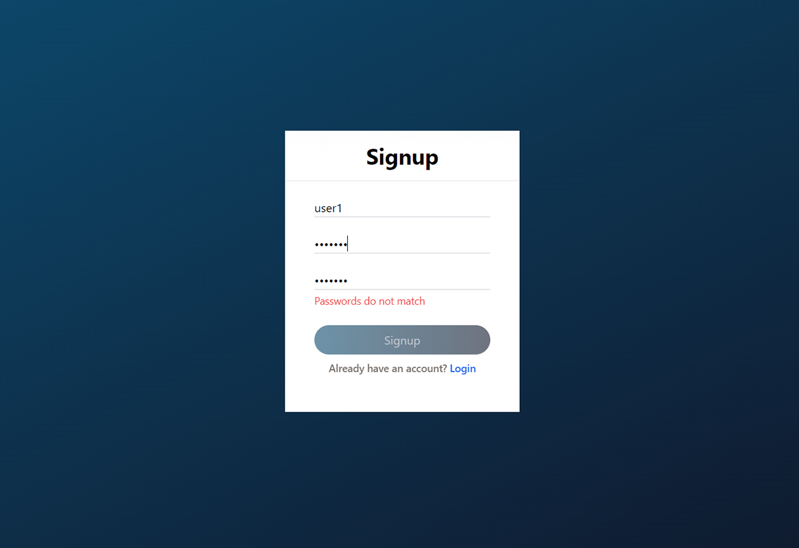
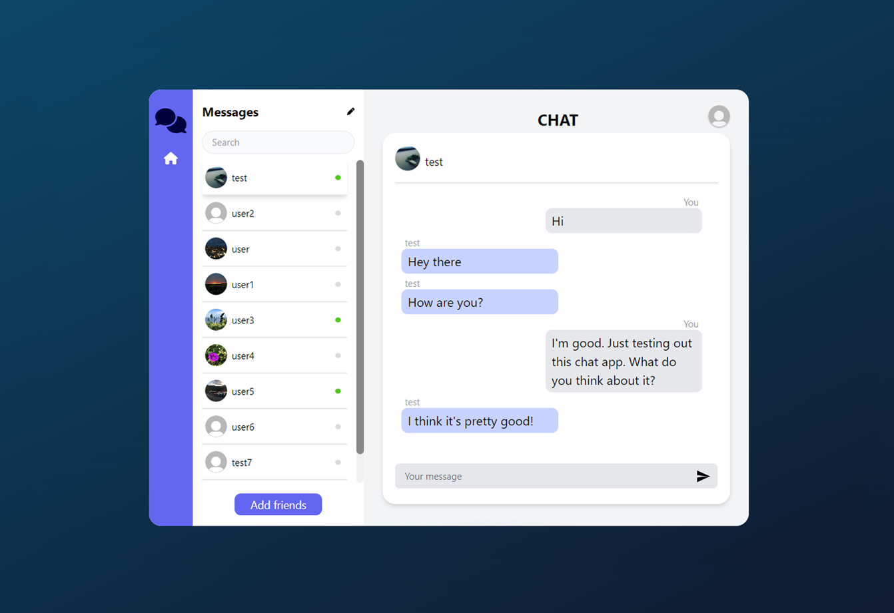

# React Chat Application

This is a full stack application which was built using **MERN** stack.
This chat application has account support which means that users are authenticated based on their credentials.
When inside the app users can add other users who can be found in the application.
Users who have added their friends can start chating with each other in real-time with the help of sockets.

- Authentication step ensures that the user is registered and stored in the database
- Users' credentials stored in the database are encrypted to prevent any potential credential leaks even if the database was breached
- Saved chat history
- Users can use custom profile images
- Active/Inactive user indication

# Technologies

Technologies used for this project:

HTML/CSS/Tailwind CSS, JavaScript, ReactJS, Redux, NodeJS/Express, Socket.io, MongoDB/Mongoose

# Install

Run the client React app:
```
cd chat/Client
npm run
```

Run the Server NodeJS app:
```
cd chat/Server
npm run
```

When server and client applications are ran, open client application in your localhost.

## Screenshots

Login window



Signup window



Chat window


